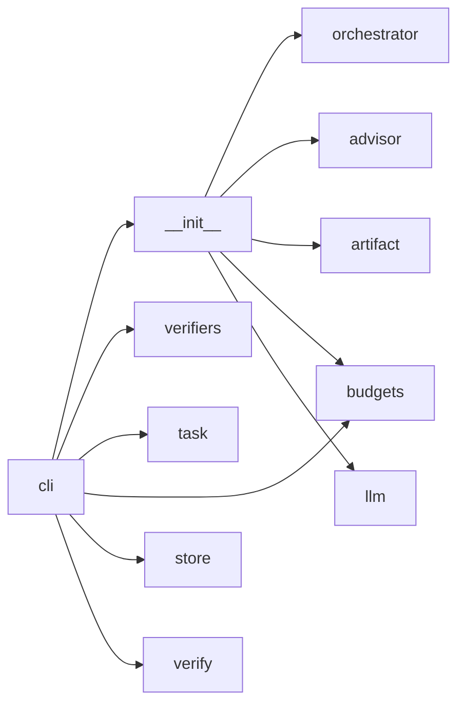
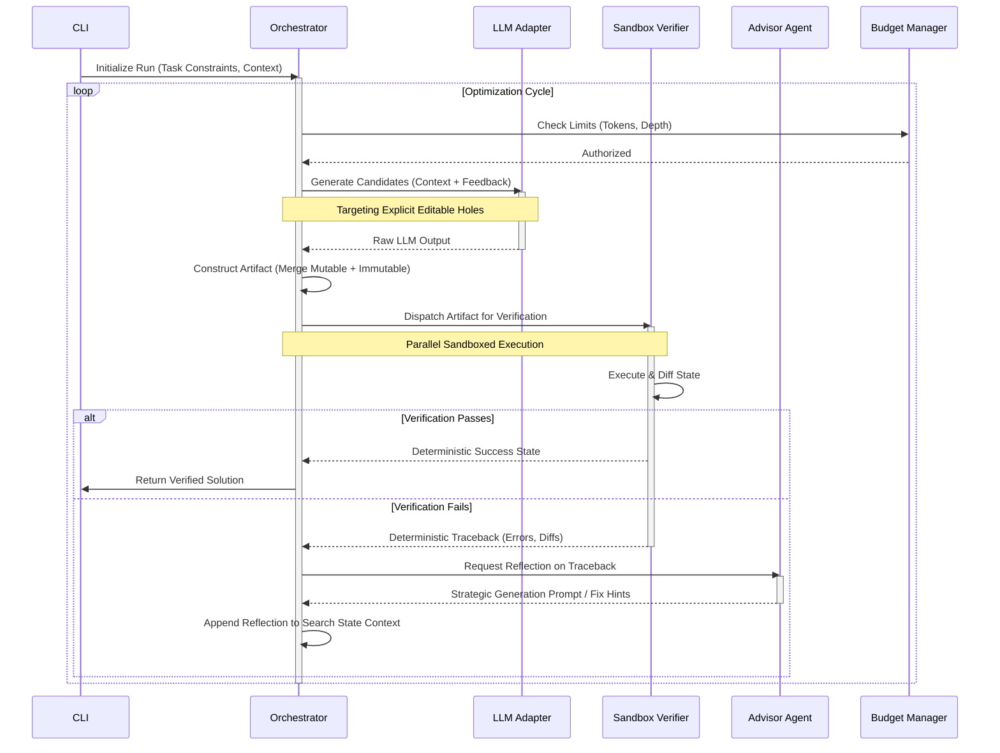

## Architecture

Crucible operates as a highly specialized, verifier-grounded multi-agent search engine. The foundational architectural paradigm marks a departure from traditional auto-regressive heuristic generation by shifting the standard of software correctness from probabilistic language model confidence to deterministic external verification. To achieve this, the system is designed around an iterative optimization loop that continuously evaluates generated artifacts against strict, immutable environmental constraints.

The system structurally divides into three primary execution domains: the Orchestration layer, the LLM Generation layer, and the Sandboxed Verification layer. By leveraging parallel processing and a distinct separation of concerns, Crucible maintains the ability to execute multiple generation trajectories concurrently while enforcing strict boundaries around arbitrary code execution.

### Core Paradigm: Verifier-Grounded Search and Optimization

At the heart of the architecture is the concept of "immutable regions and explicit editable holes." This necessitates a structural design capable of precisely mapping generated tokens to predefined spatial constraints within an artifact. 

Unlike conversational agents, Crucible models task resolution as a search problem through an expansive state space of potential solutions. The search algorithm utilizes a multi-agent feedback loop to systematically prune the state space. When an LLM worker generates a candidate solution for an editable hole, the orchestrator securely injects this candidate into the larger immutable context and dispatches it to the verification layer. The deterministic output of the verifier acts as the definitive fitness function for the candidate. If the verifier registers a failure, the resulting deterministic traceback is captured, passed to an advisor agent for reflective analysis, and incorporated as augmented context in the subsequent search iteration.

### Hardware Parallelism and Concurrency

The utilization of the `accelerate` (v1.14.0) library dictates a specific execution model designed to leverage advanced hardware topology. `accelerate` acts as the distributed computing backbone, allowing the system's parallel LLM workers and verification tasks to scale seamlessly across multi-GPU setups or compute clusters without requiring deep, custom-written MPI (Message Passing Interface) or CUDA management code. 

By integrating `accelerate`, the architecture inherently supports concurrent evaluation of multiple branches within the search space. When an editable hole is identified, the orchestrator can dispatch multiple independent LLM agents to simultaneously generate variations. These variations are then evaluated in parallel sandboxes. This distributed orchestrator-worker pattern maximizes hardware throughput and significantly reduces the wall-clock time required to discover a verifiable solution.

### LLM Provider Integration and Adapter Pattern

The Crucible architecture implements a flexible adapter pattern within its `llm` module to normalize interactions across disparate remote and local execution environments. The configuration surface relies on a standard environment variable schema to instantiate the appropriate adapter:

- **Anthropic Adapter**: Initialized via the `ANTHROPIC_API_KEY`, this subsystem maps the orchestrator's search state into Claude-specific API payloads, managing system prompts and XML-based context structures optimal for Anthropic models [.env.example:4-5].
- **Google Gemini Adapter**: Managed through `GOOGLE_API_KEY` or `GEMINI_API_KEY`, this layer translates tasks into Gemini's multi-modal or text-based instruction formats [.env.example:7-10].
- **OpenAI & Local Adapters**: Driven by `OPENAI_API_KEY` and the critically important `OPENAI_BASE_URL`, this adapter supports both direct routing to OpenAI's infrastructure and routing to locally hosted, OpenAI-compatible model runtimes (such as vLLM or Ollama). The inclusion of a configurable base URL is a key architectural decision that enables entirely air-gapped, on-premise execution of the LLM components, ensuring sensitive tasks do not leak outside the corporate boundary [.env.example:12-14].

### Module Boundaries

Crucible employs strict module boundaries to prevent bleeding of domain responsibilities. Every component operates under a well-defined contract, explicitly owning certain operational states while delegating others.

#### The CLI Interface (`crucible/cli.py`)
- **Owns**: The external user interface, argument parsing, environment variable bootstrapping, and the initial instantiation of the execution graph. It defines the runtime parameters (e.g., target task file, concurrency limits, budget parameters).
- **Does NOT Own**: Core business logic, multi-agent orchestration, or direct state mutation of the search process. The CLI acts purely as an ingress point and configuration loader.

#### Orchestration & Task Management (`crucible/orchestrator.py`, `crucible/task.py`)
- **Owns**: The overarching optimization loop, state machine progression, worker lifecycle management, and parallel task distribution. `orchestrator.py` tracks the current state of the search, managing the queue of unverified artifacts and the historical context of failed attempts. `task.py` owns the data structures that explicitly define the immutable regions and editable holes, acting as the schema for the problem domain.
- **Does NOT Own**: Specific verification logic or LLM network communication. The orchestrator delegates deterministic execution entirely to the sandbox, treating the LLM as a stateless function that receives text and outputs text.

#### Sandboxing and Verification (`verifiers`, `verify`)
- **Owns**: The deterministic execution envelope. These modules construct and tear down isolated execution environments (e.g., containers, restricted runtimes) to evaluate the artifact. They own the compilation, execution, and semantic checking of the generated code against the immutable task constraints. They also own the structured extraction of standard error, standard output, and exit codes to form the deterministic feedback payload.
- **Does NOT Own**: Deciding what to do with a failure. The verifier is an immutable oracle; it returns state but does not dictate the next search trajectory.

#### Multi-Agent Reflection (`advisor`)
- **Owns**: The diagnostic interpretation of verification failures. When the orchestrator receives a traceback from the sandbox, it delegates the payload to the `advisor` module. The advisor maps technical errors into strategic natural language prompts designed to guide the generation models toward a correct solution in the next iteration.
- **Does NOT Own**: The direct manipulation of the task definitions or direct execution of the next loop iteration. It simply produces high-quality reflective context.

#### Resource Management (`budgets`)
- **Owns**: The accounting of system resources, including token consumption, wall-clock time limits, monetary constraints across configured API providers, and maximum iteration depth. It provides a circuit-breaker mechanism to halt the optimization loop if a deterministic solution cannot be found within the allotted capacity.
- **Does NOT Own**: The scheduling of LLM API requests or the actual execution tracking. It acts as an injected dependency that is polled for authorization before expensive operations occur.

#### Data Persistence (`store`, `artifact`)
- **Owns**: `artifact` owns the structured in-memory representation of a generation attempt (e.g., the combination of the immutable task and the specific filled hole). `store` manages the persistence layer, logging the history of the optimization loop, maintaining the cache of deterministic evaluations, and allowing for resume functionality or post-run analysis.
- **Does NOT Own**: The logic dictating *what* is valid. The store is a passive repository operated by the orchestrator.

## Module Dependencies

The dependency graph illustrates a two-pronged architectural approach where the Command Line Interface acts as the ultimate root, directly interacting with domain primitives while delegating complex multi-agent logic through an SDK abstraction layer.

### Dependency Flowchart

### Topological Analysis

The system exhibits a directed acyclic graph (DAG) architecture focused heavily on inversion of control. 

1. **The CLI as the Primary Controller**: The `cli` module directly orchestrates the concrete implementations of the system's external-facing components. By directly depending on `verifiers`, `task`, `store`, and `verify`, the CLI can assemble the specific deterministic environment required for a given execution. For instance, the CLI interprets user commands to load a specific task definition and instantiate the correct verifier plugin before handing control over to the execution engine.
2. **The SDK Facade (`__init__`)**: The `cli` interacts with the complex multi-agent loop through the `sdk[__init__]` boundary. This acts as a Facade pattern, hiding the intricate orchestration complexities from the CLI.
3. **The Orchestration Core**: Beneath the SDK, the `orchestrator` acts as the primary coordinator for the multi-agent system. The dependencies branching from the SDK (`advisor`, `artifact`, `llm`) represent the active, intelligent components of the system. 
4. **Shared Dependencies (`budgets`)**: Notably, the `budgets` module is shared across both the CLI layer and the SDK layer. This cross-cutting concern is necessary because the CLI must initialize and parse the overall budget limits specified by the user, while the internal SDK/Orchestrator must continuously poll and decrement the budget during the LLM generation and verification loop.

This separation ensures that the intelligent search logic (housed behind the SDK) remains entirely decoupled from the specific domain task and verification environment (housed in the CLI's direct dependencies), enabling a highly modular and extensible system where new tasks and verifiers can be introduced without altering the core optimization loop.

## Data Flows

The data flow within Crucible is defined by a rigorous, cyclic state transition model. It does not operate on a simple request-response basis; rather, it executes a continuous feedback loop until a terminal state (Success or Budget Exhaustion) is reached.

### The Verifier-Grounded Optimization Sequence

### Flow Phase Analysis

#### Phase 1: Context Assembly and Dispatch
The flow initiates at the `CLI`, which constructs the initial task state, parsing out the immutable regions and identifying the explicit editable holes. This initial context is passed into the `Orchestrator`. Before initiating external generation, the `Orchestrator` consults the `Budget Manager` to ensure sufficient system resources exist to begin the search trajectory.

#### Phase 2: Generation and Sub-Component Integration
Upon budget authorization, the `Orchestrator` communicates with the `LLM Adapter`. The payload sent over this boundary is strictly constrained: it includes the prompt, the definitions of the editable holes, and any multi-agent reflection history from previous failed loops. The `LLM Adapter` translates this internal state into the provider-specific format (e.g., Anthropic XML or OpenAI JSON-Schema) and executes the network request. Upon receiving the generation, the `Orchestrator` maps the proposed solutions into the editable holes, merging them with the immutable regions to create a complete, cohesive `Artifact`.

#### Phase 3: Sandboxed Verification
The assembled `Artifact` is streamed across the process boundary into the `Sandbox Verifier`. This data flow is critical for system security; the arbitrary code generated by the LLM is isolated from the host orchestrator. The Sandbox executes the artifact deterministically. The state change is captured, evaluated against the required outcome defined by the original task, and transformed into a strict boolean outcome (Success/Failure) accompanied by a deterministic traceback payload (standard error logs, test runner outputs, stack traces).

#### Phase 4: Reflection and Context Augmentation
If the `Sandbox Verifier` emits a failure payload, the data flows to the `Advisor Agent`. The `Advisor` parses the dense, technical traceback and generates actionable natural language feedback—acting as a cognitive bridge between the strict compiler/verifier output and the next LLM generation cycle. This feedback is appended to the orchestration context, creating a constantly expanding context window that guides the next iteration of the loop away from previous failure modes, iteratively zeroing in on a deterministic success state.

## Sources
- `.env.example`