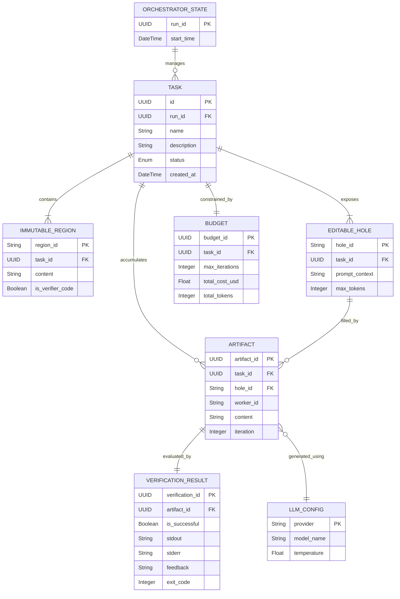

## Data Models

Based on the architectural analysis of the Crucible system, the application eschews a traditional Relational Database Management System (RDBMS) or Object-Relational Mapping (ORM) framework in favor of an in-memory, object-oriented state machine combined with a custom persistence mechanism defined in the `store` module. Crucible operates as a verifier-grounded multi-agent search engine, meaning its primary data workloads revolve around orchestrating LLM interactions, tracking sandboxed execution states, managing verification results, and handling iterative feedback loops.

The data models in Crucible are implemented as strongly-typed Python objects (likely utilizing `dataclasses` or `pydantic` given the modern LLM stack context) that encapsulate the rules of immutable task regions, editable holes, and agent budgets. These models are serialized into JSON or similar formats for persistence by the `store` subsystem and passed across process boundaries to isolated sandbox environments.

### Entity Definitions

The following entities represent the core domain model of the Crucible orchestration and execution engine. While not mapped to SQL tables, these structures define the schemas used for state management, inter-process communication, and task evaluation.

#### 1. Task
The `Task` entity is the foundational data structure in Crucible. It defines the problem to be solved, specifically emphasizing a structured approach to code or text generation by isolating "immutable regions" (which cannot be changed) from "editable holes" (where the LLM worker is permitted to generate solutions).

| Field | Type | Required | Description |
| :--- | :--- | :---: | :--- |
| `id` | `UUID` | Yes | Unique identifier for the task instance. |
| `name` | `String` | Yes | Human-readable name or title of the task. |
| `description` | `String` | Yes | The natural language prompt or problem statement provided to the agent. |
| `immutable_regions` | `List[ImmutableRegion]` | Yes | Sections of the task context that are read-only and must be preserved verbatim. |
| `editable_holes` | `List[EditableHole]` | Yes | Designated areas within the task where the LLM is expected to inject generated content. |
| `metadata` | `Dict[String, Any]` | No | Extensible key-value pairs for categorical or analytical tracking (e.g., difficulty, language). |
| `status` | `Enum` | Yes | The current lifecycle state of the task (e.g., `PENDING`, `IN_PROGRESS`, `VERIFIED`, `FAILED`). |
| `created_at` | `DateTime` | Yes | Timestamp indicating when the task was initially instantiated. |
| `updated_at` | `DateTime` | Yes | Timestamp of the last state modification to the task. |

**Serialization Example (JSON):**
```json
{
  "id": "f47ac10b-58cc-4372-a567-0e02b2c3d479",
  "name": "Fibonacci Sequence Generator",
  "description": "Implement a highly optimized Fibonacci generator.",
  "immutable_regions": [
    { "start_line": 1, "end_line": 5, "content": "def run_tests():\n..." }
  ],
  "editable_holes": [
    { "hole_id": "hole_1", "expected_type": "python_function", "context_window": "..." }
  ],
  "status": "IN_PROGRESS",
  "created_at": "2023-10-27T10:00:00Z",
  "updated_at": "2023-10-27T10:05:00Z"
}
```

#### 2. ImmutableRegion
Defines the boundaries and content of regions that the multi-agent system is explicitly forbidden from modifying. This guarantees that verifiers and test harnesses remain intact during the optimization loop.

| Field | Type | Required | Description |
| :--- | :--- | :---: | :--- |
| `region_id` | `String` | Yes | A unique local identifier for the immutable region. |
| `content` | `String` | Yes | The exact string content that must remain unmodified. |
| `start_index` | `Integer` | No | The character or line offset where the region begins (used for reconstruction). |
| `end_index` | `Integer` | No | The character or line offset where the region ends. |
| `is_verifier_code`| `Boolean` | Yes | Flag indicating if this region contains the deterministic external verification logic. |

#### 3. EditableHole
The specific target for LLM generation. By constraining generation to explicit holes, Crucible mitigates hallucination and ensures outputs fit perfectly into the surrounding immutable context.

| Field | Type | Required | Description |
| :--- | :--- | :---: | :--- |
| `hole_id` | `String` | Yes | Unique local identifier for the hole. |
| `prompt_context` | `String` | Yes | The specific instructions or surrounding context provided to the LLM for this hole. |
| `max_tokens` | `Integer` | No | The upper limit on the size of the generated artifact for this hole. |
| `validation_rules`| `List[String]` | No | Pre-flight constraints (e.g., regex patterns) that the artifact must pass before external verification. |

#### 4. Artifact
An `Artifact` is the discrete piece of work generated by an LLM worker designed to fill an `EditableHole`. Artifacts are versioned and represent the iterative attempts made by the system.

| Field | Type | Required | Description |
| :--- | :--- | :---: | :--- |
| `artifact_id` | `UUID` | Yes | Unique identifier for the generated content. |
| `task_id` | `UUID` | Yes | Foreign key referencing the parent `Task`. |
| `hole_id` | `String` | Yes | Reference to the specific `EditableHole` this artifact attempts to fill. |
| `worker_id` | `String` | Yes | Identifier for the LLM worker or agent that generated this artifact. |
| `content` | `String` | Yes | The raw generated string (e.g., code snippet, text block). |
| `iteration` | `Integer` | Yes | The loop counter indicating which optimization pass generated this artifact. |
| `generation_metrics`| `Dict` | Yes | Statistics surrounding the generation (latency, token count, finish reason). |
| `created_at` | `DateTime` | Yes | Timestamp of generation. |

**Serialization Example (JSON):**
```json
{
  "artifact_id": "a1b2c3d4-e5f6-7890-1234-56789abcdef0",
  "task_id": "f47ac10b-58cc-4372-a567-0e02b2c3d479",
  "hole_id": "hole_1",
  "worker_id": "worker_claude_01",
  "content": "def fib(n):\n    if n <= 1:\n        return n\n    return fib(n-1) + fib(n-2)",
  "iteration": 1,
  "generation_metrics": {
    "prompt_tokens": 150,
    "completion_tokens": 45,
    "latency_ms": 1200
  },
  "created_at": "2023-10-27T10:02:15Z"
}
```

#### 5. VerificationResult
Produced by the `verify` module and the custom task verifiers. This entity shifts the standard of correctness from the model's internal confidence to deterministic, external sandboxed evaluation.

| Field | Type | Required | Description |
| :--- | :--- | :---: | :--- |
| `verification_id` | `UUID` | Yes | Unique identifier for the verification run. |
| `artifact_id` | `UUID` | Yes | Reference to the `Artifact` being evaluated. |
| `is_successful` | `Boolean` | Yes | Boolean flag determining if the artifact met all external criteria. |
| `stdout` | `String` | No | Standard output captured from the sandboxed execution environment. |
| `stderr` | `String` | No | Standard error captured from the sandbox, often utilized for constructing feedback. |
| `exit_code` | `Integer` | Yes | The OS-level exit code from the verifier script (0 typically means success). |
| `feedback` | `String` | No | Synthesized, structured feedback destined to be incorporated into the next agent prompt. |
| `execution_time_ms`| `Integer` | Yes | Duration of the sandbox execution, critical for detecting infinite loops. |

#### 6. Budget
Managed by the `budgets` module, this entity ensures that the iterative optimization loop does not exhaust financial or computational resources.

| Field | Type | Required | Description |
| :--- | :--- | :---: | :--- |
| `budget_id` | `UUID` | Yes | Unique identifier for the budget tracking instance. |
| `task_id` | `UUID` | Yes | Reference to the specific `Task` being bounded by this budget. |
| `max_iterations` | `Integer` | Yes | The absolute maximum number of optimization loops permitted. |
| `current_iteration`| `Integer` | Yes | The current loop index. |
| `total_cost_usd` | `Float` | Yes | Running accumulator of API costs across all LLM providers. |
| `max_cost_usd` | `Float` | No | A hard monetary ceiling which, if breached, triggers task termination. |
| `total_tokens` | `Integer` | Yes | Sum of all prompt and completion tokens consumed during the task. |

#### 7. OrchestratorState
Managed by `crucible/orchestrator.py`, this is the root aggregate entity that tracks the entire multi-agent workflow, coordinating parallel workers and managing the lifecycle of the search engine.

| Field | Type | Required | Description |
| :--- | :--- | :---: | :--- |
| `run_id` | `UUID` | Yes | Master identifier for the entire CLI or SDK execution session. |
| `active_tasks` | `List[UUID]`| Yes | Array of `Task` IDs currently being processed by the orchestrator. |
| `completed_tasks` | `List[UUID]`| Yes | Array of `Task` IDs that have reached a terminal state (verified or failed). |
| `workers` | `List[Dict]`| Yes | Registry of active parallel sandboxed LLM workers. |
| `global_budget` | `Budget` | Yes | The overarching budget constraints for the entire session. |

#### 8. LLMConfig
Configuration payload passed to the `llm` module, determining how the application interfaces with external foundation models based on environment configurations.

| Field | Type | Required | Description |
| :--- | :--- | :---: | :--- |
| `provider` | `String` | Yes | The model provider (e.g., `anthropic`, `google`, `openai`). |
| `model_name` | `String` | Yes | The specific model identifier (e.g., `claude-3-opus-20240229`, `gpt-4-turbo`). |
| `api_key_env_var` | `String` | Yes | The environment variable containing the authentication token. |
| `base_url` | `String` | No | Overrides the default API URL, essential for local compatible runtimes. |
| `temperature` | `Float` | Yes | Sampling temperature, controlling the variance of generated artifacts. |

---

### Relationships

The following Entity-Relationship Diagram outlines the conceptual data schema of the Crucible search engine. Because the system relies heavily on iterative refinement, relationships between `Task`, `Artifact`, and `VerificationResult` form the backbone of the application's data flow.



#### Relationship Details

1. **Orchestrator to Task (`1 : N`)**: The `orchestrator.py` module tracks multiple tasks concurrently. When parallel LLM workers are deployed, the orchestrator acts as the central registry, fanning out task definitions and collecting results.
2. **Task to Regions/Holes (`1 : N`)**: A single task is mathematically and logically divided into read-only domains (`ImmutableRegion`) and write-enabled domains (`EditableHole`). An agent must respect these boundaries.
3. **EditableHole to Artifact (`1 : N`)**: For every designated hole, the agent iterative loop may produce dozens of attempts (`Artifact`). These represent the history of the optimization process.
4. **Artifact to VerificationResult (`1 : 1`)**: Every artifact generated by the LLM is deterministically evaluated exactly once by the verifiers. The resulting `stdout`/`stderr` provides the feedback necessary to generate the next artifact iteration.
5. **Task to Budget (`1 : 1`)**: The `budgets` module enforces strict lifecycle tracking per task to prevent runaway multi-agent loops from consuming unbounded API credits.

---

### Database Configuration

As detected by the architectural analysis, Crucible **does not utilize a traditional RDBMS** (like PostgreSQL or MySQL) or a standard ORM (like SQLAlchemy or Django ORM). Instead, the system's "database" configuration revolves around two primary paradigms: an internal persistence `store` and external LLM provider connections configured via environment variables.

#### 1. The Persistence `store`
The module graph identifies a dedicated `store` module (`cli --> store`). In verifier-grounded LLM workflows, the store acts as a Document or Key-Value persistence layer. 

* **Storage Medium**: State is likely written to the local filesystem as structured JSON documents or utilizing a lightweight embedded database like SQLite (though no SQL specific files were detected). 
* **State Checkpointing**: Because LLM workflows are long-running and subject to API rate limits or network failures, the `store` module serializes the `Task`, `Artifact`, and `Budget` entities at the end of each iterative loop. This allows the `orchestrator` to pause, resume, and recover active runs.
* **Concurrency Handling**: Because Crucible uses "parallel, sandboxed LLM workers", the `store` mechanism must implement safe concurrent write patterns (e.g., file-based locking or atomic rename operations) to prevent data corruption when multiple workers attempt to commit `Artifact` or `VerificationResult` objects simultaneously.

#### 2. LLM Provider "Connections"
In an agentic search engine, foundation models serve as the computational query engines. Crucible configures its connections to these engines via critical environment variables rather than traditional database connection strings:

* **Anthropic Configuration**: The environment variable `ANTHROPIC_API_KEY` is utilized to configure API access to Anthropic's Claude models, which serve as one of the generation workers in the loop [.env.example:4-5].
* **Google Gemini Configuration**: The application supports dynamic key resolution for Google's models, checking both `GOOGLE_API_KEY` and `GEMINI_API_KEY` [.env.example:7-10].
* **OpenAI & Local Model Configuration**: Connections to OpenAI (or local, self-hosted LLM endpoints running architectures like vLLM or Ollama) are configured via `OPENAI_API_KEY` and optionally overridden by `OPENAI_BASE_URL` [.env.example:12-14].

This environment-driven configuration ensures that the `llm` module can flexibly route generation workloads across different models depending on the specific `LLMConfig` tied to a task or loop iteration.

---

### Query Patterns

Because Crucible operates on in-memory object graphs backed by a bespoke `store` rather than a queryable SQL database, its "query patterns" differ significantly from typical web applications. The system employs programmatic traversal and map-reduce-style filtering over its local data structures.

#### 1. In-Memory State Traversal (ORM vs File/Memory)
Without an ORM to execute `SELECT` statements, queries are performed via Python list comprehensions and generator expressions over data loaded from the `store`.

* **Latest Artifact Retrieval**: To incorporate feedback into the next prompt, the `advisor` module must fetch the most recent iteration for a given `EditableHole`.
  * *Pattern*: The system iterates through the `artifacts` array of a `Task`, filtering by `hole_id`, and performing a `max()` operation on the `iteration` integer.
* **Budget Aggregation**: The `budgets` module must constantly calculate remaining allowances.
  * *Pattern*: Summing the `total_tokens` across all `Artifact` objects linked to a `Task` before dispatching the next request.

#### 2. Sandboxed File I/O
The most critical "query" pattern in Crucible involves preparing data for the isolated sandbox environment. 
* **Materialization**: Before a verification run, the orchestrator must stitch together the `immutable_regions` and the generated `Artifact` to create a complete, valid source file. This materialized file is then injected into the sandbox volume.
* **Result Extraction**: Following execution, the `verify` module queries the sandbox for results by reading predefined output streams (`stdout`, `stderr`) or pulling specific metric files generated during the run, mapping them back into a `VerificationResult` object.

#### 3. N+1 Loading Risks in File-Based Stores
While SQL systems suffer from N+1 query problems across network boundaries, Crucible faces analogous risks during state reconstruction if it utilizes purely file-based JSON storage:
* If the orchestrator needs to load a historical run encompassing 100 tasks, each with 50 iterative artifacts, a naive implementation might execute 5,000 distinct file `read()` operations. 
* *Mitigation Pattern*: The `store` module likely employs aggressive caching mechanisms, monolithic run-state files (saving the entire `OrchestratorState` tree as a single JSON blob), or lazy-loading strategies where `Artifact` contents are only read into memory when strictly required by the `advisor` module.

#### 4. Feedback Incorporation Queries
The core innovation of the "optimization loop" is generating the next prompt based on previous failures.
* *Pattern*: The `llm` module queries the `Store` for the `Artifact` with the highest iteration number, joins it (in-memory) with its corresponding `VerificationResult`, extracts the `stderr` and `feedback` fields, and injects this data into the prompt template for the next worker execution. This creates the iterative, grounded search mechanism defined in the system overview.

## Sources
- `.env.example`